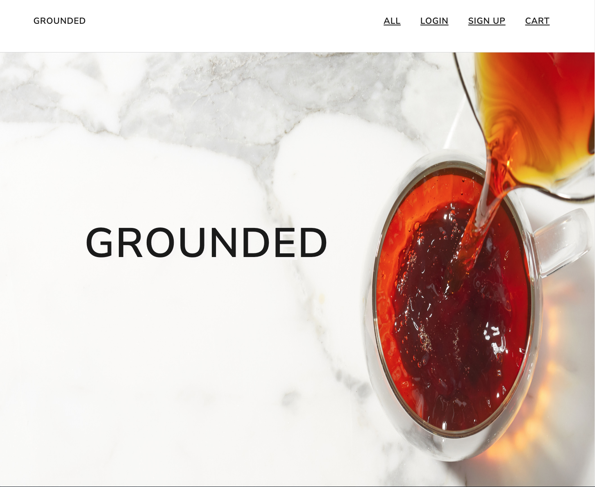
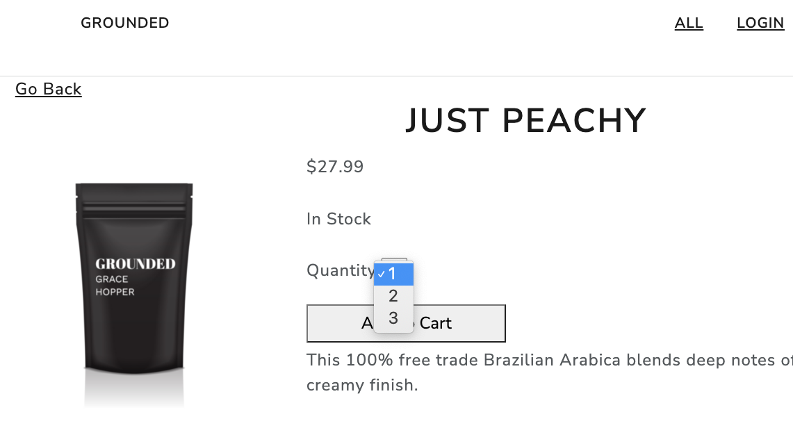
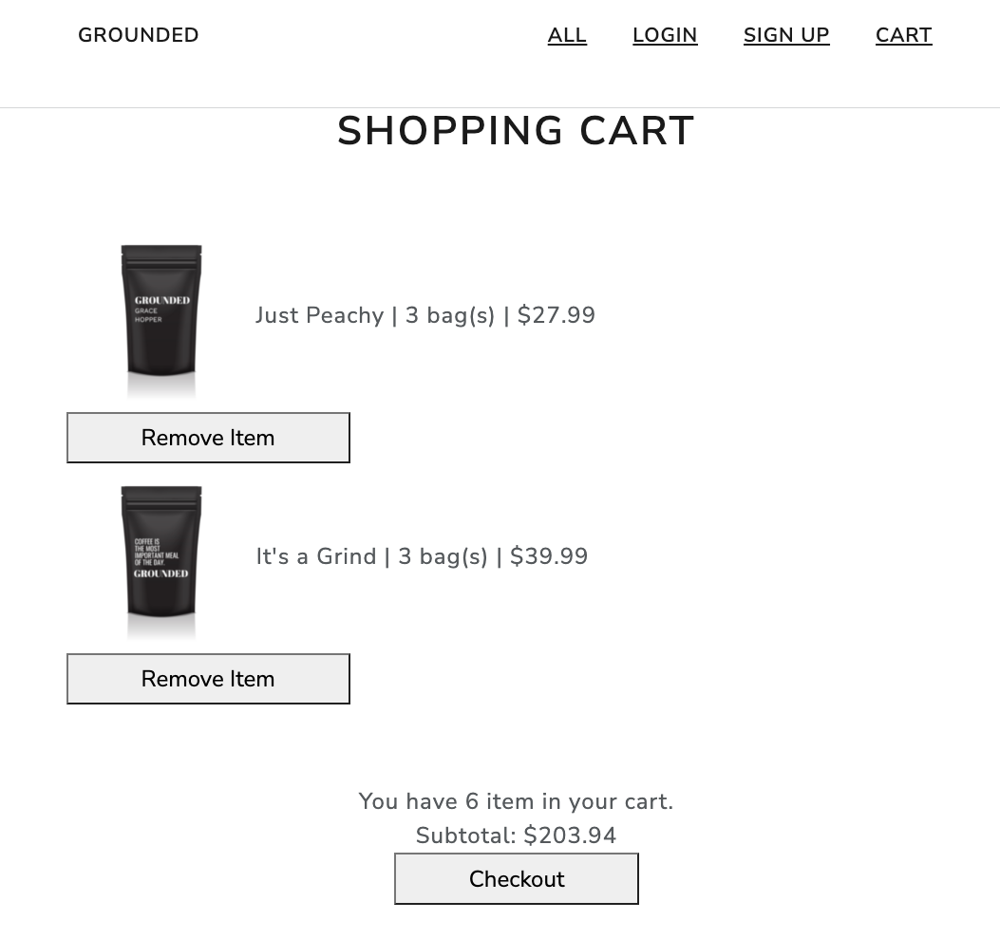

# Introduction

*Grounded* is an e-commerce web application for luxury coffees. Built using React, Redux, Node.js, Express, Sequelize, and PostgreSQL.

Checkout our deployed website: https://grounded-cafe.herokuapp.com/.

## Webpage Snippets

## Getting Started
1. Fork and clone this repo.

1. Run the command "npm install"

1. Create a database titled grounded.

1. Start the build process and your application with: npm run start:dev. If you're using Windows, you may need to execute npm run start-server and npm run build:watch separately (in their own terminal tabs).

1. Navigate to localhost:8080 to see the site in the browser.

1. Check out the starting seed file in seed.js - you can run it by executing npm run seed. You will need to seed the database once you've set up the Sequelize models.

## Meet The Team
- Tia Li @tiyali
- Victoria Lee @dalgonaio
- Sonja Pylvainen @maijaleena
- Brandy Mak @beemak789
